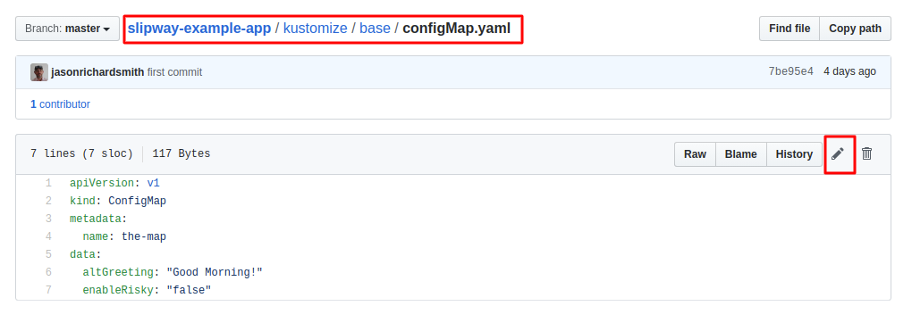

# Branch Updates

For this exercise you will need to fork the
[slipway-example-app](https://github.com/slipway-gitops/slipway-example-app).


We will need to deploy branches.yaml with the repo name replaced
with your own org from github.  You can manually edit or run envsubst

```bash
$ MY_REPO=jasonrichardsmith envsubst < branches.yaml
apiVersion: git.gitops.slipway.org/v1
kind: GitRepo
metadata:
  name: gitrepo-sample
spec:
  uri: "git@github.com:jasonrichardsmith/slipway-example-app.git"
  operations:
    - operation: test
      path: "git@github.com:jasonrichardsmith/slipway-example-app.git//kustomize/base"
      weight: 3
      optype: branch
      reference: master
```
This command produces the output I am looking for for
[this repository](https://github.com/jasonrichardsmith/slipway-example-app).

We will clear up any old gitrepos.

```bash
$ kubectl delete gitrepo gitrepo-sample
```

Now we can add the above again
```
$ MY_REPO=jasonrichardsmith envsubst < branches.yaml | kubectl apply -f -
```

If we get all of our objects we should see this.
```
$ kubectl get all
NAME                                  READY   STATUS    RESTARTS   AGE
pod/the-deployment-7fd7749979-4kvms   1/1     Running   0          66s
pod/the-deployment-7fd7749979-kkrnx   1/1     Running   0          66s
pod/the-deployment-7fd7749979-npz7v   1/1     Running   0          66s

NAME                  TYPE           CLUSTER-IP      EXTERNAL-IP   PORT(S)          AGE
service/the-service   LoadBalancer   10.98.228.156   <pending>     8666:31282/TCP   66s

NAME                             READY   UP-TO-DATE   AVAILABLE   AGE
deployment.apps/the-deployment   3/3     3            3           66s

NAME                                        DESIRED   CURRENT   READY   AGE
replicaset.apps/the-deployment-7fd7749979   3         3         3       66s
```

Also we should get our hashes.
```
$ kubectl get hash
NAME                                       AGE
75f4b6e33ebbf8e0977dca4062c8ced9d49eeeda   3m41s
```
Note the Hash name. This should change.

To see that out change has taken place we need to see the current output of our Service.

```
$kubectl port-forward service/the-service 8000:8666
```
Then we can curl or just open the url in a browser.
[http://localhost:8000](http://localhost:8000)
```bash
curl http://localhost:8000/
<html><body>
Version 1 : Good Morning!
</body></html>
```

Now we need to update master branch.
Go to the ConfigMap file ***in your repo*** and click the edit button


Change the ```altGreeting``` to anything you want aside from "Good Morning!"
and commit your change.


We will now watch our Hashes.
```
$ kubectl get hashes --watch
NAME                                       AGE
75f4b6e33ebbf8e0977dca4062c8ced9d49eeeda   17m
75f4b6e33ebbf8e0977dca4062c8ced9d49eeeda   17m
b21cb279553fd98a243056e308e32b4a03d69b45   0s
```

You will see your old commit hash will be deleted and new one launched.

We will check the objects again.

```
$ kubectl get all
NAME                                  READY   STATUS    RESTARTS   AGE
pod/the-deployment-7fd7749979-55jbw   1/1     Running   0          2m36s
pod/the-deployment-7fd7749979-przst   1/1     Running   0          2m36s
pod/the-deployment-7fd7749979-tpdw6   1/1     Running   0          2m36s

NAME                  TYPE           CLUSTER-IP    EXTERNAL-IP   PORT(S)          AGE
service/the-service   LoadBalancer   10.97.38.43   <pending>     8666:32375/TCP   2m36s

NAME                             READY   UP-TO-DATE   AVAILABLE   AGE
deployment.apps/the-deployment   3/3     3            3           2m36s

NAME                                        DESIRED   CURRENT   READY   AGE
replicaset.apps/the-deployment-7fd7749979   3         3         3       2m36s
```

All new objects were created.  Lets check the output of the service again.
```
$ kubectl port-forward service/the-service 8000:8666
```

Then we can curl or just open the url in a browser.
[http://localhost:8000](http://localhost:8000)

```bash
curl http://localhost:8000/
<html><body>
Version 1 : Howdy Howdy!
</body></html>
```

Branches, tags, and pull requests are always just pointers to commit hashes.  Every new push 
changes the pointer to the new commit.  Slipway will always keep up with where the reference
is pointing.


You can tear it down.
```bash
$ kubectl delete gitrepo gitrepo-sample
```
